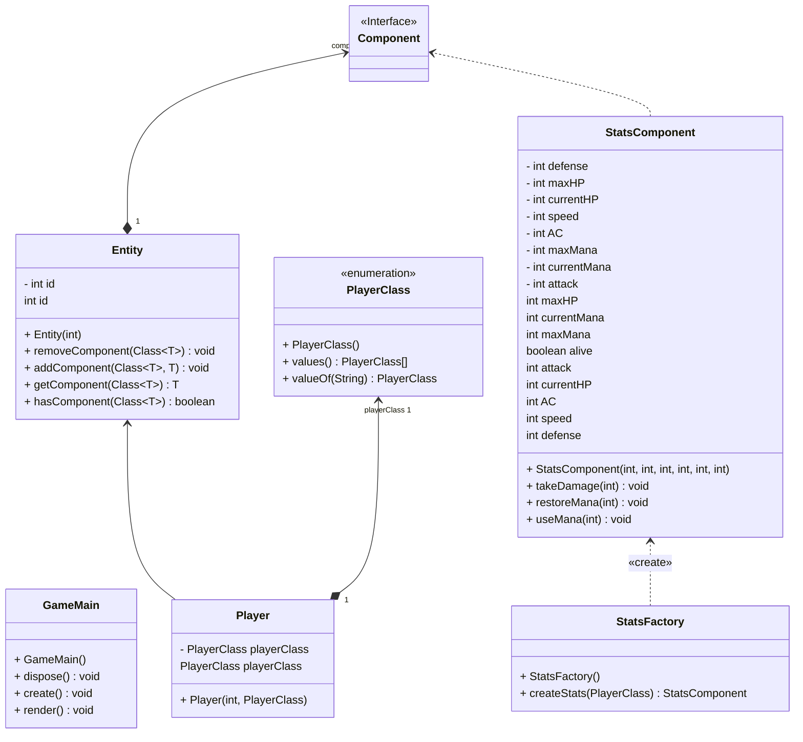

```mermaid
classDiagram
direction BT
class Component {
<<Interface>>

}
class Entity {
  + Entity(int) 
  - int id
  + removeComponent(Class~T~) void
  + addComponent(Class~T~, T) void
  + getComponent(Class~T~) T
  + hasComponent(Class~T~) boolean
   int id
}
class GameMain {
  + GameMain() 
  + dispose() void
  + create() void
  + render() void
}
class Player {
  + Player(int, PlayerClass) 
  - PlayerClass playerClass
   PlayerClass playerClass
}
class PlayerClass {
<<enumeration>>
  + PlayerClass() 
  + values() PlayerClass[]
  + valueOf(String) PlayerClass
}
class StatsComponent {
  + StatsComponent(int, int, int, int, int, int) 
  - int defense
  - int maxHP
  - int currentHP
  - int speed
  - int AC
  - int maxMana
  - int currentMana
  - int attack
  + takeDamage(int) void
  + restoreMana(int) void
  + useMana(int) void
   int maxHP
   int currentMana
   int maxMana
   boolean alive
   int attack
   int currentHP
   int AC
   int speed
   int defense
}
class StatsFactory {
  + StatsFactory() 
  + createStats(PlayerClass) StatsComponent
}

Entity "1" *--> "components *" Component 
Player  -->  Entity 
Player "1" *--> "playerClass 1" PlayerClass 
StatsComponent  ..>  Component 
StatsFactory  ..>  StatsComponent : «create»
```
