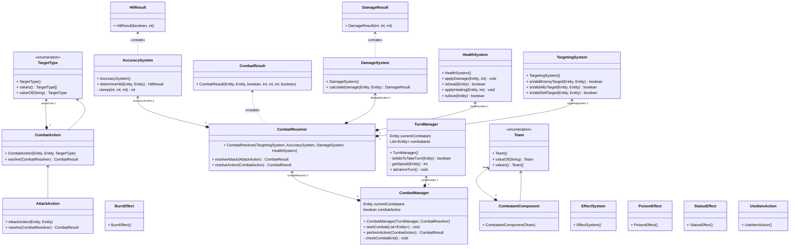

```mermaid
  classDiagram
direction BT
class AccuracySystem {
  + AccuracySystem() 
  + determineHit(Entity, Entity) HitResult
  - clamp(int, int, int) int
}
class AttackAction {
  + AttackAction(Entity, Entity) 
  + resolve(CombatResolver) CombatResult
}
class BurnEffect {
  + BurnEffect() 
}
class CombatAction {
  + CombatAction(Entity, Entity, TargetType) 
  + resolve(CombatResolver) CombatResult
}
class CombatManager {
  + CombatManager(TurnManager, CombatResolver) 
  + startCombat(List~Entity~) void
  + performAction(CombatAction) CombatResult
  - checkCombatEnd() void
   Entity currentCombatant
   boolean combatActive
}
class CombatResolver {
  + CombatResolver(TargetingSystem, AccuracySystem, DamageSystem, HealthSystem) 
  + resolveAttack(AttackAction) CombatResult
  + resolveAction(CombatAction) CombatResult
}
class CombatResult {
  + CombatResult(Entity, Entity, boolean, int, int, int, boolean) 
}
class CombatantComponent {
  + CombatantComponent(Team) 
}
class DamageResult {
  + DamageResult(int, int, int) 
}
class DamageSystem {
  + DamageSystem() 
  + calculateDamage(Entity, Entity) DamageResult
}
class EffectSystem {
  + EffectSystem() 
}
class HealthSystem {
  + HealthSystem() 
  + applyDamage(Entity, int) void
  + isDead(Entity) boolean
  + applyHealing(Entity, int) void
  + isAlive(Entity) boolean
}
class HitResult {
  + HitResult(boolean, int) 
}
class PoisonEffect {
  + PoisonEffect() 
}
class StatusEffect {
  + StatusEffect() 
}
class TargetType {
<<enumeration>>
  + TargetType() 
  + values() TargetType[]
  + valueOf(String) TargetType
}
class TargetingSystem {
  + TargetingSystem() 
  + isValidEnemyTarget(Entity, Entity) boolean
  + isValidAllyTarget(Entity, Entity) boolean
  + isValidSelfTarget(Entity, Entity) boolean
}
class Team {
<<enumeration>>
  + Team() 
  + valueOf(String) Team
  + values() Team[]
}
class TurnManager {
  + TurnManager() 
  - isAbleToTakeTurn(Entity) boolean
  - getSpeed(Entity) int
  + advanceTurn() void
   Entity currentCombatant
   List~Entity~ combatants
}
class UseItemAction {
  + UseItemAction() 
}

AccuracySystem  ..>  HitResult : «create»
AttackAction  -->  CombatAction 
CombatAction "1" *--> "targetType 1" TargetType 
CombatManager "1" *--> "combatResolver 1" CombatResolver 
CombatManager "1" *--> "turnManager 1" TurnManager 
CombatResolver "1" *--> "accuracySystem 1" AccuracySystem 
CombatResolver  ..>  CombatResult : «create»
CombatResolver "1" *--> "damageSystem 1" DamageSystem 
CombatResolver "1" *--> "healthSystem 1" HealthSystem 
CombatResolver "1" *--> "targetingSystem 1" TargetingSystem 
CombatantComponent "1" *--> "team 1" Team 
DamageSystem  ..>  DamageResult : «create»
CombatAction  -->  TargetType 
CombatantComponent  -->  Team 
```
